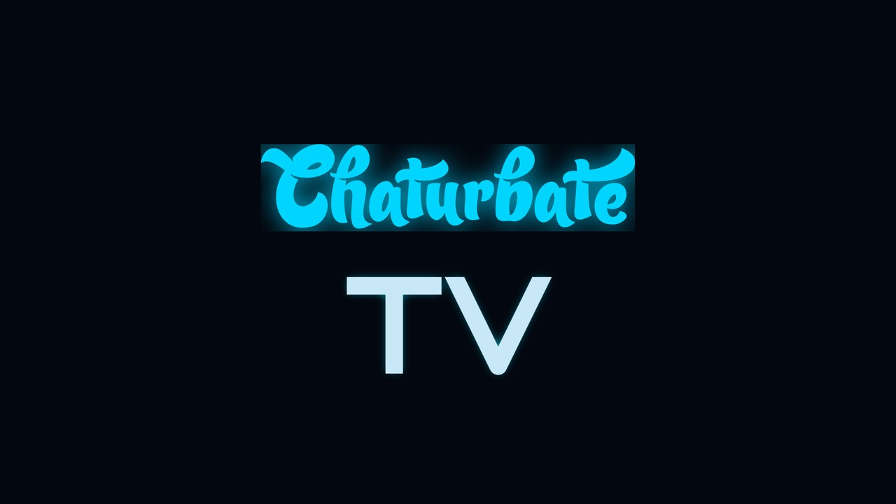

<div align="center">



# plugin.video.chaturbatetv

**A Kodi addon for Chaturbate, with TV mode.**

[]()
[]()
[]()
[]()
[]()

</div>

---

## What this is

A Kodi addon for Chaturbate. Browse rooms by category, keep a favorites
list, and run a continuous TV-mode autoplay loop driven by your own
priority list. Built clean-room from scratch, no copy-paste from other
addons, full pytest suite.

## Now for the Fun Part

So where to begin on this, I was working on a HLS proxy for another addon
to help get CB working again for them and I had a thought because i used a
AI to help with another fix of some html parsing and regex stuff cause
honestly I was in a hurry and working on other stuff at the time.

It got me thinking what does a plugin look like completely wrote by AI but
done under some very strict guidlines and with a helping hand.

This plugin is the result of that, let me explain how this all came about.

1. I got the AI to look at the proxy and then setup a base repo and then pull
all the stuff i had done from the patch for the other plugin
2. I then helped it along setting up everything and getting the base running.
3. Now for the fun part, I took a old tv and a new kodi box and set them up in
my house. I gave access to the AI to this kodi box so it could do anything it
wants.
4. I setup the AI to be complete able to do whatever it wants on this box and
the dev instance it runs on to maintain the code. This includes access to a local
repo because I don't want to just release unrestricted to GH not yet at least.
5. I helped it make the first steps to making tv mode, we got that going but
as you can guess there was lots of bugs and edge cases I left in the proxy.
6. I also helped it get the first features setup like the ability to just play
a room. This plugin you can use to just watch CB in none TV mode aswell.

Now for the even crazier stuff.

7. I thought to myself why stop here so I setup the AI to watch CB lmao.
8. I setup some very strict guidelines first tho all development has to be done
with TDD red/green testing. There has to be a over abundance of logging so much
logging its kinda funny. It has to always keep tv mode working and it has to
always be watching CB.
9. I set out to set all this harness up and get it working, I let it pick a random
set of models mostly at night because I can't sleep most of the time so I was helping
the AI work mostly then. It chose the ones it wanted in the list itself I have no idea
why its chooses were them. My only requirement was female models because literally
this TV now plays CB 24/7 at my house. Have to remember to turn the TV off at times
now.
10. So basically its directive is to constantly watch CB TV and if kodi locks up
has a issue with the stream, reconnects just anything its directive is to always keep
the TV going. What it does is when a issue happens it looks at the logs and begins
a cycle of fixing out what the problem is, doing a Red/Green TDD fix then deploying it
on the kodi box, rebooting kodi and then restarting tv mode and waiting to see if it gets
fixed or if new problems happen. So its basically just doing like a human would do. Trying
to think logically looking at debug info and it also runs tests and one off commands on the
kodi box to test stuff aswell. Anything it thinks will help with the debuging and fixing of
the problem. And the logic I set forth for TV mode and the proxy. When it feels the fix is in
it makes a commit to the repo.
11. Let the iteration begin, at first it would lock up a lot make mistakes on stuff or just
run into wild things but it always fixed it and after awhile its just been working now. It
controls the repo too.
12. It handles all the documentation and comments and all commit histories.

So now i just look at what its done over the last few days make suggestions about features I
would like have discussions with it about choices it made and sometimes it wins the discussions
and sometimes I do.

Its realy a wild experiment that has turned into something like really usable with a lot of neat
features and lol always evolving stability.

And I made a AI thats into CB now lol and watchs it all day which is neat to me at least.

## Now for a few things

I don't have a repo setup for this right now to automate installs on kodi boxes, well I do but
its local.

Its more of a safety business for people so if you are worried about Skynet taking over your kodi
box you can look at the changes the AI made to the code each time you want to deploy.

I might make one later if people are into it. That along with i might make pre packaged tgz or
something but honestly i would rather this be fully open until people get comfortable.

For the time being you can always just download the zip of the plugin from GH to get a package
you can unarchive into your plugins.

Last but not least it like all of us is not perfect :D so somethings it might need help on or it
doesn't know better like "you got to do x in addon.xml to make it install some dep like ISA"

## Install

1. Download the repo as a zip from GitHub (the green "Code" button,
   then "Download ZIP").
2. In Kodi: Settings -> Add-ons -> Install from zip file. Point at the
   downloaded zip.
3. First launch: Kodi will prompt to install `inputstream.adaptive` if
   it isn't already. Accept.
4. Open the addon. The first action is auto-discovery of online
   models, which takes a few seconds the first time.

Tested on:

- Kodi 20 (Nexus) and Kodi 21 (Omega) on LibreELEC.
- Should work on Kodi 19 (Matrix) and any platform that has Python 3.11+
  and inputstream.adaptive, but those aren't where it gets daily use.

## Getting started

The TV-mode workflow is the headline. Quick run-through:

1. Browse around (Top Cams, Female, etc.) and find some models you
   want in rotation.
2. Right-click a row -> "Add to TV". Pick a priority (1-20). Higher
   number = higher priority.
3. Repeat for as many models as you want. Same priority? They'll play
   as a randomized tier.
4. From the main menu, hit "Play TV". The loop walks the list, picks
   the highest-priority live target, plays it. When a higher-priority
   model comes online during a lower-priority playback, the loop
   promotes to the higher tier on the next iteration.
5. Hit Stop on the remote when you're done. A confirm dialog asks
   whether you actually want to exit (sticky-playback default), so an
   accidental Stop won't kill the loop.

Day-to-day the TV stays on this addon. The screensaver kicks in if no
priority model is live and there's no fallback; it bounces a label on a
black background and re-walks the list periodically until something
comes online or you dismiss it.

## Features

### 📺 TV Mode (the centerpiece)

Build a priority list of your favorite models. Hit "Play TV" and the
loop walks the list, picks a live target at the highest priority tier,
plays it, and promotes to a higher tier when one comes online.

- Multi-member tiers play as a randomized playlist so the same model
  doesn't dominate.
- Idle screensaver when nothing's live: bouncing label on a fullscreen
  black background, periodically re-walks the list.
- Takeover detection: manually playing something else releases the
  loop cleanly.
- ISA-misfire fallback: when inputstream.adaptive fires Stopped on a
  still-online stream, we re-check liveness and fall through instead
  of exiting the loop.
- Offline auto-skip: when a tier member goes offline mid-playlist, the
  player advances to the next member instead of sitting on a black
  screen.
- State-reset between iterations: every long-lived player property
  resets between tier-rebuilds so a stop event in iter N doesn't
  poison iter N+1.
- Tier-Next button keeps TV mode running: clicking Next in the player
  to switch between live tier members continues TV mode (was firing
  TAKEOVER because queued plugin URLs got resolved to localhost proxy
  URLs before onAVStarted saw them).
- Bulk live-set: TV mode uses the single-call affiliate-onlinerooms
  endpoint (1 fetch per poll cycle, ~7MB body, ~5000 live slugs)
  instead of one AJAX-per-slug. Network failure preserves the stale
  set so a transient 5xx doesn't mark every model offline.
- TTL-bounded session blocklist: a slug caught in private/hidden mode
  gets temporarily blocked from re-pick (anti-thrash), but expires
  after 15min so a model who recovers gets re-considered.
- Stall watchdog: detects ISA-side decoder freezes (corrupt CMAF
  fragments) by watching getTime() for advancement; fires Stop and
  rotates to the next iter when a frozen stream is identified.

### 🌐 Browse + Search + Favorites

- Browse modes: Top Cams, New Cams, Female, Male, Couple, Trans, Search.
- Per-gender toggles in settings to hide categories you don't want.
- Local favorites with paginated Online / Offline split.
- State-aware right-click menu: every row's ctxmenu shows the right
  set of actions (Add to TV / In TV / Edit / Remove, Add to / Remove
  from Favorites).
- Online favorites render with thumbnails, plot, and viewer count
  via the single-call affiliate endpoint.
- Offline favorites render from a local meta DB (model_meta.db)
  populated on every refresh, so Last seen / Last broadcast / cached
  thumbnail show even for non-live entries.
- View info ctxmenu: right-click any model anywhere to drop into a
  per-field profile pane with everything biocontext returns.
- 30-second in-memory cache so paging within a session is instant.

### 🎬 Playback

- Localhost HLS rewriting proxy: every layer (master, chunklist,
  segments, even LL-HLS RENDITION-REPORT URIs) routes through
  127.0.0.1 so ISA always uses our headers.
- Three-tier segment fallback: current URL, then cached CDN URL,
  then latest known segment URL. Keeps the buffer warm during edge
  rotation.
- Reconnect watchdog with cached chunklists during refresh.
- Single-use JWT redaction in logs so ?token=... never persists to
  disk.
- Matrix+ ISA properties: the inputstream key, NOT the legacy
  inputstreamaddon (silently broken on Nexus+, would just look like
  playback was off).
- Gzip-aware fetcher with magic-byte fallback for misconfigured edges.
- Max resolution cap: opt-in setting (auto / 1080p / 720p / 480p)
  caps ISA's variant pick. Auto by default; set to 720p on
  buffer-prone hosts to stop ISA upshifting past what the connection
  can sustain.
- Cross-process zombie-proxy guard: when the user picks a different
  model mid-playback, the old proxy's reconnect-give-up no longer
  fires PlayerControl(Stop) on the new player.

### 🛠 Maintenance

- Refresh artwork: main-menu entry that walks every Textures*.db
  (Kodi 19/20: v13, Kodi 21+: v14) and clears any cached row whose
  URL contains the addon ID, plus unlinks the cached file in
  Thumbnails/. Fixes the "icon never updates after a new install"
  Kodi quirk.
- Restart Kodi: main-menu entry that runs xbmc.executebuiltin('Quit').
  On LibreELEC systemd respawns Kodi automatically, so this is the
  addon equivalent of `systemctl restart kodi` without ssh access.
  Clears stuck audio-renderer state from LL-HLS cadence drift.
- Refresh offline model info / Deep refresh: rebuilds the meta DB
  from a fresh affiliate fetch (fast) or per-slug AJAX walk (slow,
  ~20min for 1000 favs).

### ⚙️ Settings

- Debug logging toggle (writes to special://temp/chaturbatetv_feature.log).
- TV poll interval (1-60 minutes).
- ISA proxy port (0 = kernel-assigned; useful for locked-down LANs).
- Screensaver color (cyan / green / hotpink, all 8-char AARRGGBB).
- Max resolution (auto / 1080p / 720p / 480p).
- Per-gender main-menu visibility (Female / Male / Couple / Trans).
- Deep refresh rate (1-30 sec/slug; ban-risk dial).
- Dialog timeout (5-60 sec; how long the exit prompt waits before
  resuming playback).

## Quality bar

- 819 tests all passing (`pytest`, no Kodi required).
- mypy --strict clean across resources/lib/.
- ruff clean.
- Pre-commit hook runs all three on every commit.
- Every regression has a pinned test before the fix lands.

## Design pillars

| Pillar | What it means |
|---|---|
| 🧪 **TDD strict** | Every change starts with a failing test |
| 🔒 **Original code** | Clean-room rewrite, no copy-paste from existing addons |
| 📊 **Gated logging** | `_log` everywhere, off by default, redacts secrets |
| 🌐 **JSON over HTML** | All listings via the JSON API; no HTML scraping |
| 🚦 **Boundary tolerance** | Every parser tolerates malformed input |
| 🔌 **Inject the network** | Tests hand in `fetch_func`; no urllib hooks |
| ⚡ **Single-call where possible** | Affiliate-onlinerooms beats paginated walks |

## Layout

```
addon.xml                 Kodi manifest (single source of truth for version)
default.py                Plugin entry point
resources/
  lib/                    All Python modules (pure + Kodi-shaped)
  language/               strings.po
  media/                  icons, screensaver assets
  settings.xml            User-facing settings declarations
tests/                    pytest test suite
  fixtures/               sample JSON for parser tests
  kodi_mock/              Mock Kodi runtime for offline TV-loop tests
  stubs/                  type stubs for xbmc* modules (mypy --strict)
tools/                    standalone CLIs (one-shot migration)
```

## Module map

| Module | Responsibility |
|---|---|
| `default.py` | Entry point, dispatches via `router` |
| `resources.lib.router` | Mode dispatch from `sys.argv` |
| `resources.lib.cb_endpoints` | URL builders (room-list, affiliate-onlinerooms, AJAX status) |
| `resources.lib.cb_client` | HTTP client (iPad UA, injectable fetch) |
| `resources.lib.cb_listing` | Pure parser: JSON to `Model` |
| `resources.lib.cb_resolve` | slug to `Resolution` (live + HLS URL + headers) |
| `resources.lib.cb_models` | Domain types (`Model`, `Favorite`, `TVEntry`, `Gender`) |
| `resources.lib.browse_views` | Top / New / Female / Male / Couple / Trans / Search views |
| `resources.lib.favs_views` | Favorites menu + Online/Offline paginated views |
| `resources.lib.tv_loop` | TV mode outer loop + `_TVPlayer` event handler |
| `resources.lib.tv_select` | Pure tier-pick / collect-live-tier / walk-live |
| `resources.lib.tv_classify` | Pure event-classifier (ISA misfire vs user stop) |
| `resources.lib.tv_state` | Single-source-of-truth for `chaturbatetv_active` |
| `resources.lib.tv_store` | Atomic `tv.json` read/write |
| `resources.lib.favs_store` | Atomic `favs.json` read/write |
| `resources.lib.model_meta_store` | sqlite store + render helpers for offline rows |
| `resources.lib.hls_proxy` | Localhost rewriting proxy (master + chunklist + segment + RENDITION-REPORT) |
| `resources.lib.playvid_resolver` | slug to ListItem with ISA props |
| `resources.lib.screensaver` | Idle screensaver Window + bouncing label |
| `resources.lib.ctxmenu` | State-aware context menu builder |
| `resources.lib.kodi_helpers` | Thin Kodi UI wrappers |
| `resources.lib.addon_settings` | Typed settings accessors with safe defaults |
| `resources.lib.addon_actions` | Side-effect verbs (fav_add/remove, tv_*, search, playvid) |
| `resources.lib.logger` | Gated `_log` to chaturbatetv_feature.log |

## Dev workflow

```bash
uv pip install --python .venv/bin/python pytest pytest-randomly mypy ruff
.venv/bin/python -m pytest -v
.venv/bin/python -m ruff check resources/ tests/
MYPYPATH=tests/stubs .venv/bin/python -m mypy --strict resources/lib/
```

If you're sending a PR, please run all three (pytest, ruff, mypy --strict)
before opening it. The bar for a merge is: tests green, ruff clean,
mypy --strict clean. A small shell snippet you can drop into
`.git/hooks/pre-commit` to enforce locally:

```bash
#!/usr/bin/env bash
set -e
.venv/bin/python -m pytest -q
.venv/bin/python -m ruff check resources/ tests/
MYPYPATH=tests/stubs .venv/bin/python -m mypy --strict resources/lib/
```

## View modes

For best UX, set the view mode to InfoWall or MediaList in Kodi's
view-selector when browsing. Puts thumbnails on the right and the room
info on the left.

## Migration from cumination

`tools/migrate_from_cumination.py` reads cumination's `favorites.db`
and `cookies.lwp` and writes them into chaturbatetv's userdata.
Idempotent: safe to re-run.

```bash
python3 tools/migrate_from_cumination.py \
    --src /storage/.kodi/userdata/addon_data/plugin.video.cumination/ \
    --dst /storage/.kodi/userdata/addon_data/plugin.video.chaturbatetv/
```

Migration is tolerant: missing source files, schema-drifted favorites
DBs, and orphaned cookies all fall through gracefully.

TV-mode priority lists are this addon's own concept (cumination doesn't
have one), so there's nothing to migrate for that. After your favorites
land, set up your TV list via the right-click "Add to TV" entry on any
model.

## Status

Phases 1 through 5 plus QA pass and v0.7.x polish are all shipped and
running on the live install. Followed-cams (login required) is the only
remaining feature on the conditional list.

| Phase | Status |
|---|---|
| 1: pure modules + tests | shipped |
| 2: browse + favorites + migration | shipped |
| 3: followed-cams stub | deferred to Phase 7 |
| 4a: MVP HLS proxy | shipped |
| 4b: playvid + ISA props | shipped |
| 4c: proxy hardening | shipped |
| 5: TV mode + screensaver + ctxmenus | shipped |
| QA pass: CRITICAL/HIGH/MEDIUM/LOW | shipped |
| 6: polish + cutover | shipped |
| 7: login + followed-cams | conditional |

### Recent ship list

| Version | Headline |
|---|---|
| 0.7.50 | Caching-wedge watchdog: trips when Player.Caching=True for >120s (catches decoder freezes where getTime() crawls and the v0.7.42 watchdog can't see the stall) |
| 0.7.49 | Window-property TTL bump (5s -> 15s) for silent-stub mark-offline; v0.7.48's 5s window was too tight for the actual race timing |
| 0.7.48 | Window-property fallback for silent-stub mark-offline (catches the zombie-Stop-vs-silent-stub race) |
| 0.7.47 | In-addon-switch guard: clicking a different model from TV list / favs no longer misclassified as a real user-stop |
| 0.7.46 | Fix the addon.xml `<source>` URL pointing at the public GitHub repo (housekeeping after going public) |
| 0.7.45 | TTL on silent-stub session blocklist; recovered models get re-considered after 15min |
| 0.7.44 | Cross-process zombie-proxy guard via getPlayingFile() |
| 0.7.43 | Zombie-proxy guard for takeover playback |
| 0.7.42 | Stall watchdog false-positive fix + mark-offline rotation |
| 0.7.41 | Stall watchdog for ISA-side decoder freezes |
| 0.7.40 | Takeover detection robust to single-model tiers |
| 0.7.39 | Security fixes from audit pass #5 + manifest news escape guard |
| 0.7.38 | Error-handling + resource-leak fixes from audit pass #4 |
| 0.7.37 | Race-audit fixes (4 architectural changes) |
| 0.7.36 | Audit pass #3: backfill missing test coverage on critical paths |
| 0.7.35 | Audit pass: defensive polish in fetch + parser symmetry |
| 0.7.34 | Browse views show non-public state badges instead of trapping clicks |
| 0.7.33 | Anti-thrash session blocklist for slugs caught in non-public state |
| 0.7.32 | Affiliate parser honors current_show; non-public rooms stay out of TV pick |
| 0.7.30 | Pagination removed from offline favs (single-batch render) |
| 0.7.29 | Silent-stub mark-offline via queued-paths fallback |
| 0.7.28 | Last-broadcast Pacific-tz fix; biocontext-404 marks gone; Add-to-TV back-out |
| 0.7.27 | View info gets per-field directory + working clicks |
| 0.7.25 | View info ctxmenu + rich profile pane |
| 0.7.24 | biocontext breakthrough: full public profile JSON via Referer |
| 0.7.20 | Refresh offline model info menu entry |
| 0.7.19 | Render offline favs and TV-list rows from cached meta DB |
| 0.7.18 | Foundation: model_meta.db sqlite store |
| 0.7.15 | Silent stub for offline-tier playback (no more "playback failed" dialog) |
| 0.7.13 | Sticky-playback enforcement: Yes/No exit dialog, no double-press gestures |
| 0.7.10 | TV-mode resilience fix: PlayerControl(Next) + cache invalidation |
| 0.7.9 | Auto-stop previous proxy + STOP REINFORCED on chunklist failures |
| 0.7.7 | Terminal-chunklist fix: VOD body + PlayerControl(Stop) |
| 0.7.6 | TV mode list sorts highest-priority on top |
| 0.7.0 | Tier-Next button fix; max_resolution setting; Refresh artwork + Restart Kodi menu items |
| 0.6.9 | TV mode bulk affiliate endpoint; hls_proxy race fix; MEDIUM/LOW QA bundle |
| 0.6.6 | Single-call affiliate-onlinerooms endpoint |
| 0.6.4 | URGENT: API limit drift fix (limit=100 cap) |
| 0.6.0 | Phase 5 ships: TV mode + screensaver + state-aware ctxmenus |

See `addon.xml` for the full per-version notes.

## License

GPL-2.0-or-later. See [`LICENSE`](LICENSE).
